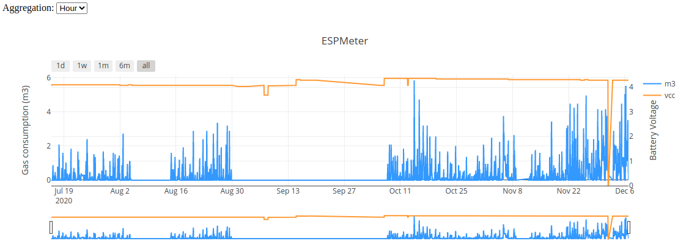
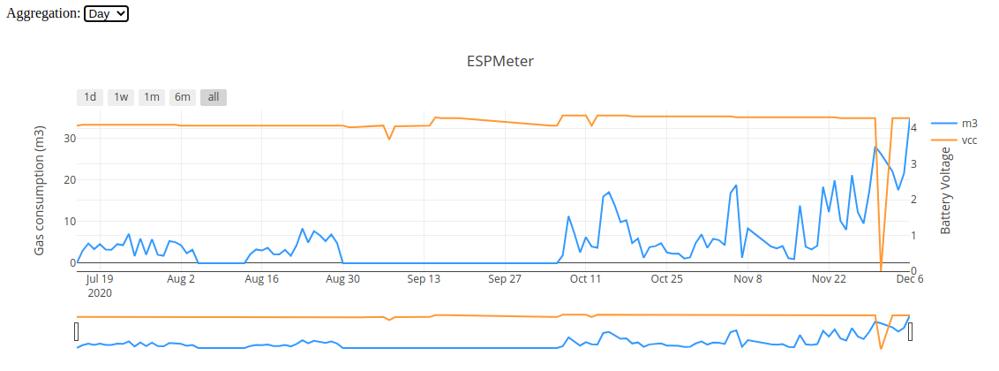

Track gas consumption; a small device captures 
data from the gas meter which is then sent to a server via HTTP; a web 
application allows visualizing daily gas consumption with a granularity up to 
5 minutes.

